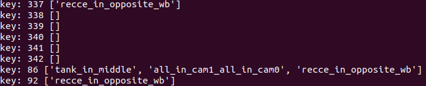
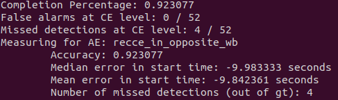

# DistributedCE
Distributed Complex Event Detection Architecture

## Setup (if you are using )

1. Run `git clone --recurse-submodules https://github.com/nesl/DistributedCE.git`


### If you are using the simulator and Mininet, follow the below instructions.  Otherwise, move onto the next subsection.

2. Follow the instructions in [ComplexEventSimulator](https://github.com/nesl/ComplexEventSimulator) to install the simulator.
3. Create two virtual environments: **venv** using **requirements.txt** file in root directory, and **yolo** using **requirements.txt** file in **detection** directory (create it there).
4. Change directory: `cd ../network`
5. Clone [Mininet](https://github.com/mininet/mininet) and move the **mininet/mininet** subfolder to the current directory.

### In other cases (e.g. running experiments on Soartech's data), do the following:

1. Download the neuroplexLog.csv and *.pt files from here[https://drive.google.com/drive/folders/1rtDrUmSf0J82Yfqy7YAAkp5GdHntoitj?usp=share_link].  You will need to place them under the top level directory "DistributedCE/".
2. Install the following requirement files:
     - DistributedCE/requirements.txt
     - DistributedCE/detection/requirements.txt

## Running experiments

You can run experiments by simply doing 
```
python run_experiment.py
```
This file will do several things.  It will run a bash script for every camera (camera.sh) to measure different atomic events (it runs detection/load.py).  It will also run a server process (ce_server.sh, which runs detection/LanguageCE/test_ce.py) that listens to these atomic events (transmitted UDP data over the loopback interface) and processes them.  

### Important configuration notes:
There's a bit of configuration involved when setting up experiments - namely, you need to alter the directories that you read video data from, or change which complex event you want to evaluate.

Under detection/run_experiment.py, you need to alter the variable video_parent_folder to wherever your videos are.  If your video_parent_folder is "../videos", then your file structure would look like "../videos/take_100".  To change how the experiments are run (e.g. use different CE), you have to alter the variable events_of_interest (explanation given above its declaration in code).


## Evaluating experiment results

By default, all experiment results will be saved under detection/ce_results.  To evaluate experiment results against the ground truth of the complex events, you can run:
```
python run_metrics.py
```
Similar to run_experiment.py, you will need to alter some of the configuration.  See the comment for "START IMPORTANT CONFIG VARIABLES" - you will need to alter video directories, the complex event you wish to evaluate, etc.

### A bit on the output of the evaluation.

The output of run_metrics.py will display each take and the list of missed atomic events, if any.  For example:

shows that for video 86, multiple atomic events were missed.  But for video 342, no atomic events were missed.

The remaining metrics are fairly self explanatory:

This will display how many videos where the full complex event was detected, how many complex events were missed, how many atomic events were missed, error in start time, etc.


